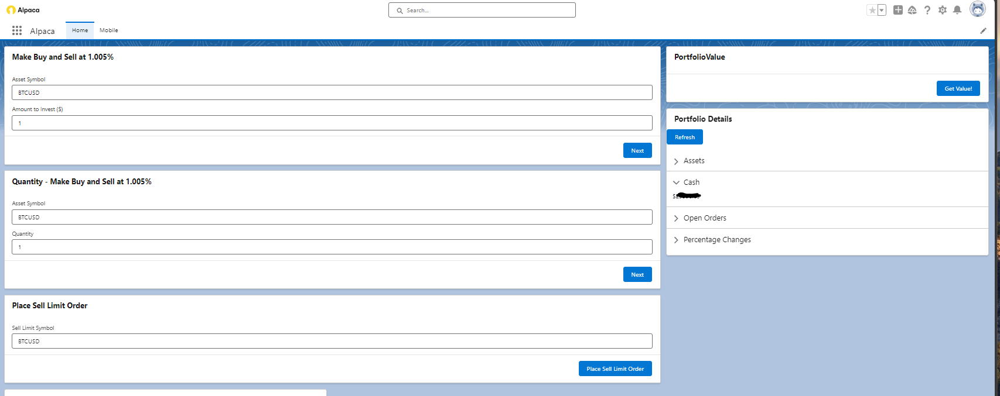

# Salesforce Trading Dashboard



A custom trading dashboard built on **Salesforce** with **Alpaca API** integration. This application leverages Salesforce’s **Aura Components**, **Flows**, **Named Credentials**, and **Lightning Homepages** to provide users with seamless trading functionality and real-time portfolio management.

## Features

1. **Buy and Sell at Custom Percentages**  
   - Users can enter asset symbols and investment amounts to make buy and sell orders based on a configurable percentage.  

2. **Place Limit Orders**  
   - Allows users to set limit orders for specific assets directly from the interface.  

3. **Portfolio Details**  
   - Displays detailed portfolio metrics, including cash balance, open orders, and percentage changes.  

4. **Real-Time Updates**  
   - The dashboard dynamically updates portfolio values and transaction statuses.  

## Technology Stack

### Salesforce Components

- **Aura Components:** Enable reusable and customizable UI components.
- **Lightning Homepages:** Provide a responsive and dynamic interface for users.
- **Flows:** Orchestrate backend logic and handle trading workflows.
- **Named Credentials:** Securely manage Alpaca API keys and endpoints.

### Backend Integration

- **Alpaca API:** Supports real-time trading functionalities, including buy/sell orders and portfolio management.

---

## Setup Instructions

1. **Prerequisites**
   - Salesforce Developer Org or Sandbox
   - Alpaca API credentials (API Key, Secret Key, and Base URL)

2. **Configure Named Credentials**
   - In Salesforce Setup, go to **Named Credentials**.
   - Create a new named credential:
     - URL: `https://paper-api.alpaca.markets`
     - Authentication: Basic Authentication (add your Alpaca API key and secret key).

3. **Deploy Aura Components**
   - Deploy the Aura components to your Salesforce org using a metadata deployment tool (e.g., Workbench or Salesforce CLI).

4. **Set Up Flows**
   - Import the provided Flow XML and configure it to use the Alpaca Named Credential.

5. **Customize Lightning Homepage**
   - Add the Trading Dashboard Aura component to a custom Lightning Homepage.

---

## Usage

- **Place Orders:**
  - Use the input fields to specify asset symbols, investment amounts, or order quantities.
  - Execute buy, sell, or limit orders seamlessly.

- **View Portfolio Details:**
  - Refresh portfolio values to see the latest cash balance and open order details.

---

## Troubleshooting

1. **API Connection Issues**
   - Verify Named Credentials are correctly configured with valid API keys.
   - Ensure the Alpaca API endpoint is accessible.

2. **Order Execution Fails**
   - Ensure the market is open during testing.
   - Verify sufficient cash balance in the Alpaca paper trading account.

3. **Component Not Displaying**
   - Check that the Aura component is added to the Lightning Homepage.
   - Verify that the Aura components were deployed successfully.

---

## Contributing

Contributions are welcome! Feel free to suggest improvements or report issues.

1. Fork the repository.
2. Create your feature branch:
   ```bash
   git checkout -b feature/new-feature
   ```
3. Commit your changes:
   ```bash
   git commit -m "Add new feature"
   ```
4. Push to the branch:
   ```bash
   git push origin feature/new-feature
   ```
5. Open a pull request.

---

## License

This project is provided under the MIT License. You are free to modify and distribute this project as long as the original license is included.

---

## Disclaimer

This project is for educational purposes only and not financial advice. Use at your own risk. Always verify API credentials and ensure you are using a paper trading account to avoid unintended real trades.


